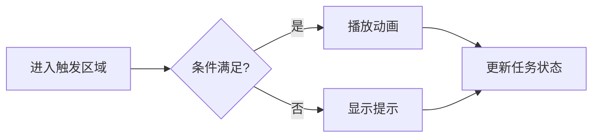
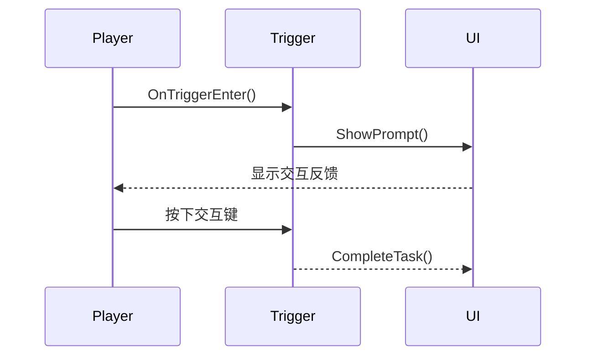

<!--
[Sources]
- https://sli.dev/guide/syntax.html
-->

---
layout: toc
activeSection: 1
---

---
layout: default
activeSection: 1
---

# 标题层级：H1 到 H6

## 二级标题：组织主要内容

### 三级标题：划分内容层次

#### 四级标题：补充局部主题

##### 五级标题：标记细节

###### 六级标题：最末级标题

正文用于承载解释、论证与叙述，六级标题均由主题提供明确的字号、字重和间距。

---
layout: default
---

# 行内文本、链接与转义

普通正文支持 **粗体**、*斜体*、***粗斜体***、~~删除线~~ 和 `行内代码`。

[具名链接](https://sli.dev)、自动链接 <https://sli.dev> 与邮箱 <yang.liu@bupt.edu.cn> 都可以直接使用。

反斜杠可以显示原始标记：\*这不是斜体\*，HTML 实体也会解析：&copy;、&rarr;、&nbsp;。

在行尾输入两个空格<br>
即可产生一个显式换行；空一行则开始新的段落。

---
layout: default
---

# 引用、分隔线与原生 HTML

> 一级引用适合结论、定义或原话。
>
> > 引用也可以继续嵌套，并包含 **Markdown 强调**。

***

<mark>mark 标签</mark>、H<sub>2</sub>O、x<sup>2</sup>、<kbd>Space</kbd> 都可以通过原生 HTML 写入。

<details>
  <summary>点击展开 details 内容</summary>
  HTML 元素内部也可以承载补充说明。
</details>

---
layout: toc
activeSection: 2
---

---
layout: default
---

# 无序、有序、嵌套与任务列表

- 无序列表
  - 二级项目
    - 三级项目
- 同级项目

1. 有序列表第一步
2. 有序列表第二步
   1. 子步骤 A
   2. 子步骤 B

- [x] 已完成：定义主题参数
- [x] 已完成：实现内容布局
- [ ] 待完成：添加更多业务组件

---
layout: default
---

# 表格、对齐与混合格式

| 语法     | 默认对齐                |  居中  | 右对齐 |
| -------- | :---------------------- | :----: | -----: |
| 普通文本 | 左                      |   中   |     右 |
| 强调     | **粗体**                | *斜体* | `code` |
| 状态     | [文档](https://sli.dev) |   ✅    |   100% |

表格单元格可以继续使用强调、链接、行内代码和 Emoji；主题会让表格字号与正文保持一致。

---
layout: default
activeSection: 2
---

# Markdown 图片与主题 Figure

标准 Markdown 图片语法：


<Figure
  caption="Figure 组件：图片居中，说明文字固定在下方"
  width="38%"
  maxHeight="12cqw"
/>

<style>
.bupt2024-markdown-body > p > img {
  display: block;
  width: 38%;
  max-height: 12cqw;
  margin: 0.5cqw auto;
  object-fit: cover;
}
</style>

---
layout: default
---

# LaTeX：行内公式与独立公式

行内公式会跟随正文排版，例如欧拉公式 $e^{i\pi}+1=0$，以及二次公式
$x=\frac{-b\pm\sqrt{b^2-4ac}}{2a}$。

独立公式使用双美元符号，并自动居中：

$$
\int_{a}^{b} f(x)\,\mathrm{d}x = F(b)-F(a)
$$

不应使用 `<center>$...$</center>`；如需把行内公式单独居中，可以写：

<div class="text-center text-2xl">

$\beta_1$

</div>

<!--
[Sources]
- https://sli.dev/features/latex
-->

---
layout: default
---

# LaTeX：对齐、矩阵与分段函数

$$
\begin{aligned}
\nabla \cdot \vec{E} &= \frac{\rho}{\varepsilon_0} \\
\nabla \cdot \vec{B} &= 0 \\
\nabla \times \vec{E} &= -\frac{\partial \vec{B}}{\partial t}
\end{aligned}
$$

$$
A=\begin{bmatrix}1&2\\3&4\end{bmatrix},\qquad
f(x)=\begin{cases}x^2,&x\ge 0\\-x,&x<0\end{cases}
$$

KaTeX 还支持求和、极限、向量、集合、上下标、括号和常用数学字体。

---
layout: default
---

# Comark：给 Markdown 元素添加属性

启用 `comark: true` 后，可以直接为 Markdown 内容添加类名或样式。

这段文字包含[主题红强调]{style="color:#c2272b;font-weight:700"}，也可以设置[字间距]{.tracking-widest}。

{style="width:52%;max-height:15cqw;object-fit:cover;margin:1cqw auto"}

```md
这是一段[红色文字]{style="color:#c2272b"}
{width=480px lazy}
```

<!--
[Sources]
- https://sli.dev/features/comark
-->

---
layout: default
activeSection: 3
---

# Shiki 语法高亮

```ts
interface SceneConfig {
  title: string
  activeSection: number
  interactive?: boolean
}

const scene: SceneConfig = {
  title: '数字校园',
  activeSection: 3,
  interactive: true,
}
```

语言标识决定高亮规则；本主题显式使用 Shiki，并保留 Slidev 的复制功能。

---
layout: default
---

# 行号、静态高亮与逐步高亮

每次“下一步”会切换高亮区域：

```ts {12-13|5|all}{lines:true,startLine:10}
function add(
  a: number,
  b: number,
) {
  return a + b
}
```

较长代码可以设置最大高度并滚动：

```js {*}{maxHeight:'9cqw'}
const chapters = ['一', '二', '三', '四', '五', '六']
const active = chapters.findIndex(item => item === '三')
console.log({ active, chapter: chapters[active] })
```

<!--
[Sources]
- https://sli.dev/features/line-highlighting
- https://sli.dev/features/code-block-line-numbers
-->

---
layout: default
---

# Code Group：多种实现放在同一位置

::code-group

```sh [npm]
npm install slidev-theme-bupt-sdmda-red
```

```sh [pnpm]
pnpm add slidev-theme-bupt-sdmda-red
```

```sh [yarn]
yarn add slidev-theme-bupt-sdmda-red
```

::

Code Group 依赖 Comark；点击标签即可切换代码块。

<!--
[Sources]
- https://sli.dev/features/code-groups
-->

---
layout: default
---

# Shiki Magic Move：代码随点击变形

````md magic-move [scene.ts] {duration:500}
```ts
const scene = '校园'
```
```ts
const scene = {
  name: '校园',
  interactive: false,
}
```
```ts
const scene = {
  name: '校园',
  interactive: true,
}
```
````

<!--
[Sources]
- https://sli.dev/features/shiki-magic-move.html
-->

---
layout: default
---

# Monaco Runner：现场编辑并运行

点击代码块右上角的运行按钮，可以修改 JavaScript 并查看结果。

```js {monaco-run} {autorun:false}
const scores = [82, 91, 76, 95]
const average = scores.reduce((sum, value) => sum + value, 0) / scores.length

console.log(`平均分：${average}`)
```

Monaco 适合现场编码；静态讲解优先使用 Shiki，加载更轻。

<!--
[Sources]
- https://sli.dev/custom/config-monaco
-->

---
layout: default
---

# 从源文件导入代码片段

下面的代码不是复制到本页的，而是从 `snippets/interaction.ts` 的命名区域导入：

<<< @/snippets/interaction.ts#trigger-handler ts {2,6}{lines:true}

导入语法仍可组合语言标识、行号、高亮、Monaco 和最大高度等选项。

<!--
[Sources]
- https://sli.dev/features/import-snippet
-->

---
layout: default
activeSection: 4
---

# Mermaid：流程图与判断分支



Mermaid 代码块会直接渲染成 SVG 图表，适合流程、状态、关系和架构说明。

<!--
[Sources]
- https://sli.dev/guide/syntax.html#diagrams
-->

---
layout: default
---

# Mermaid：时序图




同样的语法还支持类图、状态图、甘特图、ER 图、饼图和思维导图等 Mermaid 图形。

---
layout: default
---

# Vue、UnoCSS 与内置组件

Markdown 中可以直接写 Vue 组件、Vue 表达式和 UnoCSS 类。

<div class="grid grid-cols-3 gap-4 my-5 text-center">
  <div class="p-4 rounded bg-red-50 text-red-800">当前页<br><SlideCurrentNo /></div>
  <div class="p-4 rounded bg-stone-100 text-stone-700">总页数<br><SlidesTotal /></div>
  <div class="p-4 rounded bg-white/65 text-stone-700">表达式<br>{{ 2 + 3 }}</div>
</div>

<div class="h-18 text-center">
  <AutoFitText :max="44" :min="22">AutoFitText 会让文字自动适配容器</AutoFitText>
</div>

<!--
[Sources]
- https://sli.dev/guide/component
- https://sli.dev/builtin/components.html
-->

---
layout: default
---

# Rough Marker：手绘式强调

标记会与点击步骤同步：

- <span v-mark.underline.red>下划线强调</span>
- <span v-mark.circle.red>圆圈强调</span>
- <span v-mark="{ color: '#8a181c', type: 'highlight' }">自定义颜色高亮</span>

```vue
<span v-mark.circle.red>需要强调的内容</span>
```

再次播放本页时，依次点击即可观察每个标记出现。

<!--
[Sources]
- https://sli.dev/features/rough-marker.html
-->

---
layout: default
activeSection: 5
clickAnimation: up
---

# 点击动画：逐项展示

<v-clicks>

- 第一次点击：先给出问题背景
- 第二次点击：再展示关键证据
- 第三次点击：最后呈现结论

</v-clicks>

<div v-click class="mt-5 text-center text-xl text-red-800">
  也可以把 `v-click` 直接写在任意 HTML 或 Vue 元素上。
</div>

<!--
先介绍为什么需要分步呈现。

[click] 第一项出现时说明背景。

[click] 第二项出现时说明证据。

[click] 第三项出现时给出结论。

[Sources]
- https://sli.dev/guide/animations
-->

---
layout: default
---

# VSwitch：按点击次数替换内容

<v-switch class="mt-8 text-center text-2xl">
  <template #0>初始状态：等待交互</template>
  <template #1>第一次点击：进入触发区域</template>
  <template #2>第二次点击：显示操作提示</template>
  <template #3>第三次点击：完成交互任务</template>
</v-switch>

`VSwitch` 适合逐步替换同一位置的图、公式、结论或状态，不会让页面越堆越满。

---
layout: two-cols
columnRatio: 1fr 1fr
columnGap: 3.2cqw
columnDivider: true
---

# 命名插槽：双栏 Markdown

::left::

## 左栏：场景构建

- 建立基础模型
- 统一材质与灯光
- 控制资源命名

::right::

## 右栏：交互反馈

1. 配置碰撞体
2. 编写触发事件
3. 添加动画和声音

---
layout: two-cols
columnRatio: 42% 58%
columnGap: 3.4cqw
columnAlign: center
---

# 双栏图文与图片说明

::left::

## Figure 组件

图片可以设置宽度、最大高度、适配方式、整体对齐和图注对齐。

图注既可通过 `caption` 传入，也可以写在默认插槽中。

::right::

<Figure
  caption="图 1：图片保持比例，说明文字位于下方"
  width="100%"
  maxHeight="23cqw"
/>

---
layout: default
transition: slide-left
zoom: 0.94
---

# 页面 Frontmatter 与局部 CSS

本页通过 frontmatter 单独设置了 `transition: slide-left` 和 `zoom: 0.94`。

```yaml
layout: default
transition: slide-left
zoom: 0.94
```

<p class="scoped-demo">下面的 <code>&amp;lt;style&amp;gt;</code> 只影响当前页面，不会污染其他幻灯片。</p>

<style>
.scoped-demo {
  padding: 0.8cqw 1.1cqw;
  border-left: 0.32cqw solid #c2272b;
  background: rgba(194, 39, 43, 0.08);
}
</style>

<!--
[Sources]
- https://sli.dev/guide/syntax.html#frontmatter-headmatter
- https://sli.dev/guide/syntax.html#scoped-css
- https://sli.dev/features/zoom-slide
-->

---
layout: default
activeSection: 6
---

# 页面参数覆盖主题默认值

每一页都可以在 frontmatter 中临时覆盖主题参数：

```yaml
surfaceEffect: glass
overlayOpacity: 0.72
statusGlassBackground: '#8a181c'
primary: '#c2272b'
activeSection: 6
```

参数优先级始终是：**当前页 frontmatter → 全局 themeConfig → 主题内置默认值**。

如果本页没有写 `activeSection`，主题会继承此前最近一次显式设置的章节。

---
src: ./pages/imported.md
---

---
layout: default
---

# 还可以使用哪些 Slidev 能力？

| 能力           | 写法或入口                                   | 默认示例策略                   |
| -------------- | -------------------------------------------- | ------------------------------ |
| PlantUML       | `plantuml` 代码块                            | 需要 PlantUML 服务，未在线渲染 |
| 化学公式       | `\ce{...}`                                   | 需要加载 KaTeX `mhchem` 扩展   |
| 视频与社交媒体 | `SlidevVideo`、`Youtube`、`Tweet`、`BlueSky` | 需要媒体文件或网络             |
| TwoSlash       | TypeScript 代码块扩展                        | 适合类型教学，按项目启用       |
| 可拖拽元素     | 拖拽指令、`VDragArrow`                       | 拖动位置会写入 frontmatter     |
| 可写 Monaco    | `{monaco-write}` + 代码导入                  | 会改写源文件，使用前应备份     |

这些能力属于 Slidev，而不是主题专属组件；按项目需求启用即可。

<!--
[Sources]
- https://sli.dev/features/
- https://sli.dev/builtin/components.html
-->

---
layout: end
---

# 示例结束

可以从任意一页复制语法，作为新演示文稿的起点。
